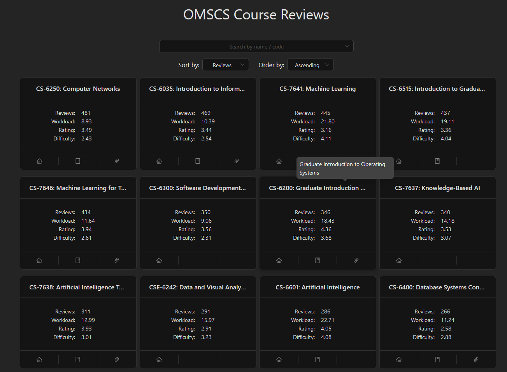
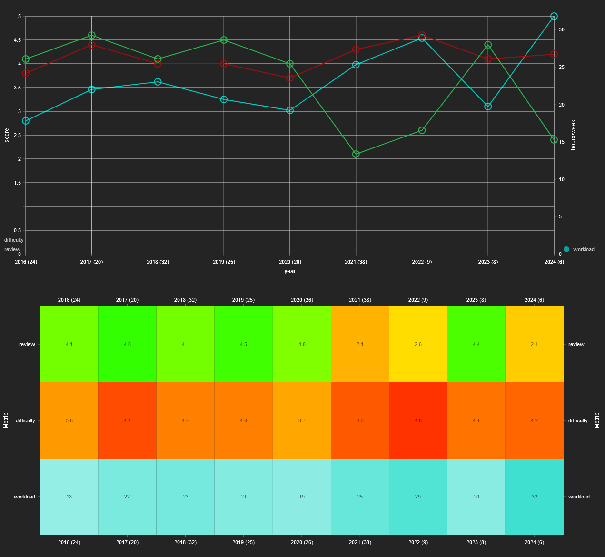

# OMSCS-Review-Analyzer

Interactive website for analyzing Georgia Tech's OMSCS course reviews, sourced from [OMSCentral.com](https://www.omscentral.com/).

## Features

<div style="display: flex; gap: 16px;">
    
    
</div>
<br />

-   Line chart & heatmaps of course review / workload / difficulty scores, aggregated on a yearly interval.
-   Summary of reviews on a semester-by-semester basis

## Codebase

```sh
site/           # React website
packages/       #
    data/       # Compiled course data, stored in TS files
    scraper/    # Scripts for scraping data off of OMSCentral
```

### PNPM Scripts

#### Site

```sh
pnpm site {cmd}     # Run script in site package, from root directory
# --------------------------------------------------------------------------------
pnpm site dev       # Run vite dev-server
pnpm site build     # Build website
```

#### Scraper

```sh
pnpm scraper {cmd}  # Run script in scraper package, from root directory
# --------------------------------------------------------------------------------
pnpm scraper scrape # Run the web scraper process
```

#### Data

```sh
pnpm data {cmd}     # Run script in data package, from root directory
# --------------------------------------------------------------------------------
pnpm site build     # Build website
```
